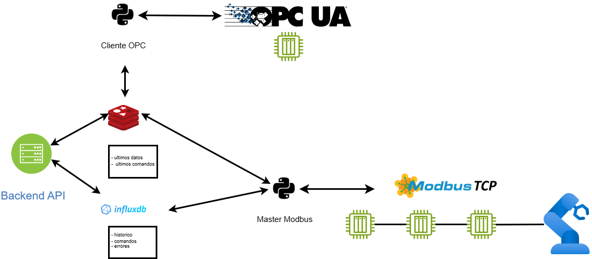

# robot_server
Arquitectura de servidor para lineas con varios protocolos de comunicacion. El objetivo es conseguir que estos recursos puedan ser manejados y consultados mediante una API para mayor flexibilidad, ademas de proporcionar una puerta a integrar mas servicios y caracteristicas como una visualizacion

## Diagrama

## Para PLC 
- Recibe
{
  "device_id": "robot1",
  "position": {"x": 123.4, "y": 456.7, "z": 789.0},
  "running": true,
  "alarm_code": 104,
  "timestamp": "2025-06-24T12:34:56Z"
}

-manda
{
  "order_id": "ORD_1001",
  "target_device": "robot1",
  "type": "method",
  "name": "process_01",
  "params": {
    "quantity": 5,
    "dx": 1.2,
    "dy": -0.3,
    "dz": 0.0,
    "speed": 1200
  }
}

## Modbus kafka bridge

# [ borunte_01 → producer ]         \
# [ borunte_02 → producer ]  ----->  kafka topic: "robot_status"
# [ borunte_03 → producer ]         /

# Estructura del mensaje:
# robot.commands
# {
#     "order_id": "ORD_20230626123456_borunte_01",
#     "target_id": "borunte_01",
#     "type": "method",
#     "name": "set_output",
#     "params": ["y13", 1]
# }

# robot.status
# {
#     "target_id": "borunte_01",
#     "ip": "127.0.0.1",
#     "online": true,
#     "status": {
          "order_id": "...",
#         "y13": 1
#     },
#     "timestamp": "2023-06-26T12:34:56.789Z"
# }

# robot.responses
# {
#     "target_id": "borunte_01",
#     "type": "method",
#     "online": True,
#     "command": method_name,
#     "result": {"status": True, ...},
#     "error": None,
#     "timestamp": "2023-06-26T12:34:56.789Z"
# }